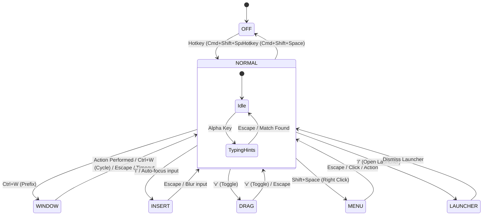

# Mode State Machine

`vimlayer` operates as a modal interface for macOS, similar to Vim or Vimium. It captures keyboard input and translates it into mouse actions, window management, or application control based on its current **Mode**.

## Overview of Modes

| Mode | Status | Description |
| :--- | :--- | :--- |
| **OFF** | - | Application is running but the overlay is hidden. System keys behave normally. |
| **NORMAL** | `N` | Default active mode. Keys are captured and mapped to navigation and actions. |
| **INSERT** | `I` | Keys are passed through to the focused application. Used for typing. |
| **WINDOW** | `W` | Prefix mode (e.g., `Ctrl+W`) for window management commands. |
| **DRAG** | `D` | Mouse button is held down; navigation keys move the cursor to drag elements. |
| **MENU** | - | Right-click context menu is open. Navigation keys move the cursor; others exit. |
| **LAUNCHER** | - | Application launcher (Alfred-like) is open. |

---

## State Machine Diagram

---

## Mode Transitions

### 1. OFF ↔ NORMAL
*   **Activation**: The global hotkey (`Cmd+Shift+Space` by default) toggles the entire overlay.
*   **Behavior**: When active (NORMAL), a global event tap intercepts almost all keyboard input to prevent it from reaching the underlying application.

### 2. NORMAL → INSERT
*   **Manual**: Pressing `i` in NORMAL mode enters INSERT mode.
*   **Auto-Insert**: If enabled in settings, focusing a text input field in any application will automatically switch to INSERT mode.
*   **Behavior**: The event tap is removed, allowing normal typing in the target application.

### 3. INSERT → NORMAL
*   **Manual**: Pressing the global hotkey (`Cmd+Shift+Space`) while in INSERT mode returns to NORMAL mode.
*   **Auto-Exit**: If the focus leaves a text input field (and it was auto-entered), the system returns to NORMAL mode.

### 4. NORMAL → WINDOW (Prefix Mode)
*   **Trigger**: Pressing `Ctrl+W` enters a transient prefix state.
*   **Behavior**: The watermark changes to "WINDOW". The system waits for a second key to perform a window management action (e.g., tiling, centering, cycling).
*   **Exit**: Returns to NORMAL mode immediately after any action is performed (including cycling), or after a 5-second timeout. This ensures that every window command requires the prefix (`Ctrl+W`) again. Note that after cycling, the "WINDOW" watermark may remain visible to indicate a window session is active, even though the prefix must be re-pressed.

### 5. NORMAL → DRAG
*   **Trigger**: Pressing `v` toggles mouse dragging.
*   **Behavior**: Performs a mouse-down at the current cursor position. Navigation keys (`h`, `j`, `k`, `l`) now move the cursor while "holding" the mouse button.

### 6. NORMAL → MENU
*   **Trigger**: Performing a right-click (`Shift+Space`).
*   **Behavior**: Installs a specialized event tap that allows `h`, `j`, `k`, `l` to move the mouse cursor while a context menu is open, but allows other keys to pass through (to select menu items).

---

## Default Key Bindings (NORMAL Mode)

| Key | Action |
| :--- | :--- |
| `h`, `j`, `k`, `l` | Move mouse cursor Left, Down, Up, Right |
| `Space` | Left Click |
| `Shift + Space` | Right Click |
| `Ctrl + f` / `Ctrl + b` | Scroll Down / Up |
| `w` / `b` | Mouse Forward / Back |
| `f` | Toggle Hint Labels (2s) |
| `i` | Enter INSERT mode |
| `v` | Toggle DRAG mode |
| `/` | Open Application Launcher |
| `?` (Shift + /) | Toggle Cheat Sheet |
| `Ctrl + w` | **WINDOW Prefix** |
| `Esc` | Reset typing / Dismiss hints / Cancel Drag |

### Window Commands (After `Ctrl+W`)

| Key | Action |
| :--- | :--- |
| `Ctrl + w` | Cycle through visible windows |
| `h`, `j`, `k`, `l` | Tile Window to Left, Bottom, Top, Right Half |
| `1`, `2`, `3`, `4` | Tile Window to Quarters |
| `q`, `w`, `e` | Tile Window to Top Sixths (L, C, R) |
| `a`, `s`, `d` | Tile Window to Bottom Sixths (L, C, R) |
| `c` | Center Window |
| `Return` | Maximize Window |
